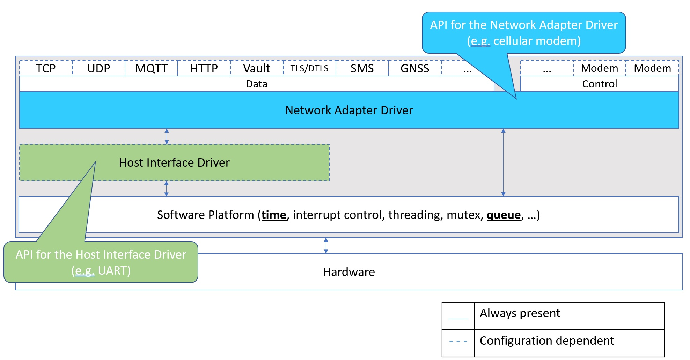
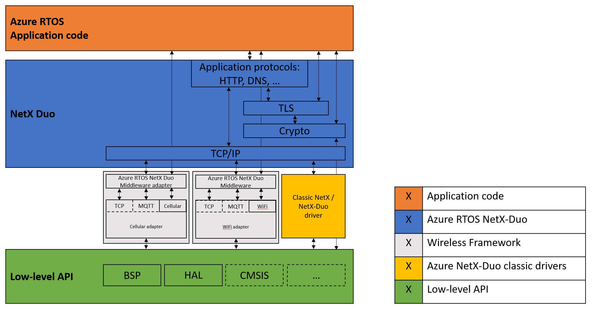

# Embedded Wireless Framework

The Embedded Wireless Framework simplifies the development of internet and cloud connectivity for embedded device software by defining a set of APIs for network adapters, host interfaces, platforms, and software stacks. The goal is to provide a standard framework for writing applications and controlling wireless network adapters (cellular, wifi, ...) while abstracting a driver interface for hardware vendors to plug in modules with self-developed drivers.

## Objectives

- Simplify development of IoT devices connecting to the cloud via various combinations of communication adapters and host processors.
- Provide lifecycle management of communication adapter drivers for embedded application code in embedded IoT devices.
- Ease migration between communication adapters during production or product transition.
- Enable wireless chip and module vendors to deliver drivers for their products.
- Encapsulate common functions in a robust re-useable module while flexibly offering an interface for vendor-specific enhancements reducing development time for device builders.
- Encapsulate the port connection for cellular modules enabling agility for embedded processor vendors and device builders for various port configurations.

# Public preview notice

The project is currently in public preview. It is under active development and breaking changes may occur.

# Architecture

**Network Adapter Driver** (ewf_adapter in the code) is the component that implements control and data handling of the Network Adapter. The initial design is focused on cellular and wifi, but it is generic to allow for others (LoRa, Ethernet, ...).

The framework defines common *control and data APIs* (ewf_adapter_api_*.h), implemented uniformly across adapters. Control APIs depend on the adapter technology, some of these are modem API (based on 3GPP), WiFi API, LoRa API. Data APIs handle sending and receiving of raw or application layer data and are adapter technology independent, some of these are TCP, UDP, TLS, MQTT. Application code has easy access to the functionality of different adapters using a common API.

**Host Interface Driver** (ewf_interface in the code) serves as an abstraction for the logical communication channel between a Network Adapter Driver and the Network Adapter.  This means that a Network Adapter Driver can be developed to be independent of the Host interface used by using the *interface API* (ewf_interface.h). For example, a cellular modem connected to the microcontroller over UART, SPI, USB or GPIO, can use the same Network Adapter Driver.

**Platform*** The Embedded Wireless Framework is abstracted from the host operating platform software by a thin wrapper *platform API* (ewf_platform.h) that offers access to the functionality necessary to develop Network Adapter Drivers and Host Interface Drivers. On the initial phase platform implementations are provided for Azure RTOS, FreeRTOS, bare-metal, and Windows, with more planned.

## Framework use

The framework API can be used directly by the application code, or another software stack. Implementations for using Azure RTOS NetX-Duo and the Azure Embedded C SDK are provided. 
Application code can use the API directly, with help from the Azure Embedded C SDK, or with a software MQTT client (e.g. Paho C)

The framework simplifies and unifies the writing of Azure RTOS NetX-Duo drivers. Drivers based on the framework can be used in parallel to classic NetX-Duo drivers; existing NetX-Duo drivers remain unmodified and supported.

For details on the framework API look at the doxygen generated documentation.

# Build and Test

The code is built out of each individual example. Refer to each example for more details. Note: The examples are built using different tool-chains and IDEs.

# Examples and drivers

This is the list of network adapters, host interfaces, software platforms and hardware boards currently supported or under development.

# Network Adapters

The framework supports several network adapter types.

## Cellular
Cellular modems in the same family are likely to work with small changes:
- Quectel BG96
- Quectel BG95
- Quectel BC95
- Renesas RYZ014
- SIMCom SIM7000
- SIMCom SIM7600
- SIMCom SIM900
- SIMCom SIM868
- SIMCom SIM800

## WiFi
- ESP8266
- ESP8285
- ESP-WROOM-02
- MX-CHIP EMW3080

## LoRa
- LoRa E5
- EBYTE E32
- SEMTECH SX1276

## Ethernet
- WIZnet W5500
- WIZnet W5100

# Host Interfaces

These interfaces can be used in any combination with the supported adapters:
- WIN32 COM (adapter built-in USB, or over FTDI FT232RL, CP2102, CH314T, ...)
- Linux serial port (adapter built-in USB, or over FTDI FT232RL, CP2102, CH314T, ...)
- ST STM32xxxx UART
- Renesas RAxxxx UART
- Renesas RXxxxx UART
- NXP LPCxxxx UART
- NXP RTxxxx UART
- Microchip/Atmel SAMxxxx UART
- Generic GPIO bit-banging
- Azure RTOS USBX CDC ACM

# Software platforms

- Azure RTOS (on embedded boards and Windows/Linux emulation)
- FreeRTOS (on embedded boards and Windows/Linux emulation)
- WIN32
- bare-metal

# Hardware boards

- Windows on PC
- Linux on PC
- ST STM32U585 Discovery Kit for IoT
- ST STM32L496 Discovery Kit
- ST STM32L475 Discovery Kit IoT Node
- ST STM32L7S5 Discovery Kit IoT Node
- Renesas RA EK-RA6M4
- Renesas RX RX65N Cloud Kit
- NXP LPC55S69-EVK
- NXP i.MX-RT1050-EVK
- NXP i.MX-RT1060-EVK
- Microchip SAM54-X-Plained Pro
- Microchip PIC32CM
- Raspberry Pi (Linux)
- Raspberry Pi Pico

# Examples

These examples are currently available, they are further developed and more examples will be added:
- Info: query adapter information. This example is used for verifying basic operation of the framework. It can be the starting point for developing your own application if you want to communicate with the adapter directly using AT commands.
- Test: test adapter functionality. It is useful for further development of network adapter driver functionality and troubleshooting.
- Certs/basic: provision certificates and keys into the network adapter for a single end-point.
- Telemetry/basic: send telemetry to the Azure IoT Hub using basic MQTT.
- Certs (under development): provision certificates and keys into the network adapter for multiple end-points/configurations.
- Telemetry (under development): send telemetry to the Azure IoT Hub using full MQTT.
- EWF + Azure RTOS NetX Duo (undergoing an update).
- Paho MQTT client for embedded C.
- Paho MQTT client + Azure Embedded C SDK.

# Contributing

This project welcomes contributions and suggestions.  Most contributions require you to agree to a
Contributor License Agreement (CLA) declaring that you have the right to, and actually do, grant us
the rights to use your contribution. For details, visit https://cla.opensource.microsoft.com.

When you submit a pull request, a CLA bot will automatically determine whether you need to provide
a CLA and decorate the PR appropriately (e.g., status check, comment). Simply follow the instructions
provided by the bot. You will only need to do this once across all repos using our CLA.

This project has adopted the [Microsoft Open Source Code of Conduct](https://opensource.microsoft.com/codeofconduct/).
For more information see the [Code of Conduct FAQ](https://opensource.microsoft.com/codeofconduct/faq/) or
contact [opencode@microsoft.com](mailto:opencode@microsoft.com) with any additional questions or comments.

# Trademarks

This project may contain trademarks or logos for projects, products, or services. Authorized use of Microsoft
trademarks or logos is subject to and must follow
[Microsoft's Trademark & Brand Guidelines](https://www.microsoft.com/en-us/legal/intellectualproperty/trademarks/usage/general).
Use of Microsoft trademarks or logos in modified versions of this project must not cause confusion or imply Microsoft sponsorship.
Any use of third-party trademarks or logos are subject to those third-party's policies.

# Related

For more information on the software components used in this project, follow the links below:
- [Azure](https://azure.com/)
- [Azure RTOS](https://azure.com/rtos)
