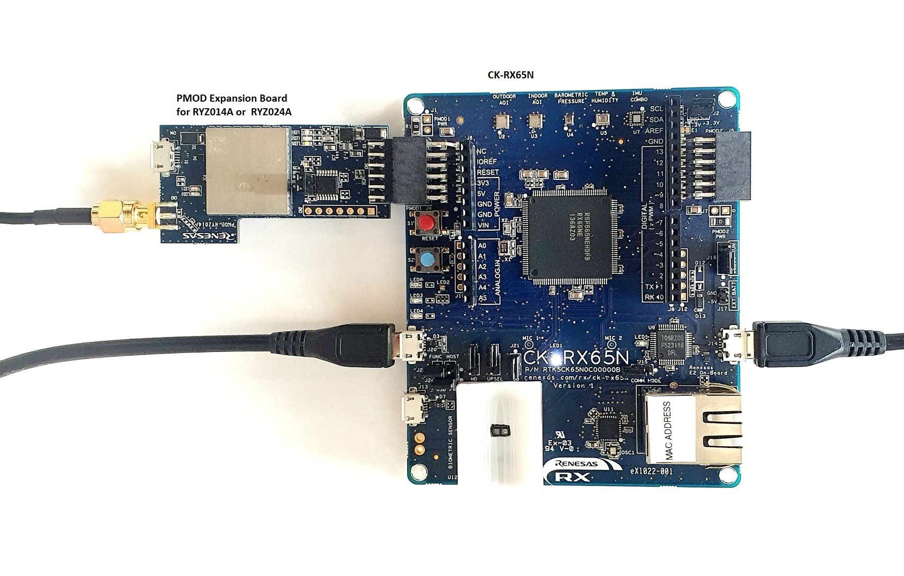

# Embedded Wireless Framework examples for Renesas RX
The purpose of these examples is to show the use of EWF with the Renesas RX family of microcontrollers.
Embedded Wireless framework(EWF) is meant to simplify connecting small devices to the internet using different connectivity adapters.
An adapter is the device or software used to connect the application using the EWF API to the internet.
An adapter can be a cellular modem, a WiFi adapter, an Ethernet adapter, a WinSock software layer, a BSD software layer or other type of device or software.
The EWF API is described in the Doxygen documentation generated out of the common code.
The source files of the EWF are located in the \src directory at the root of this repository.
The current set of examples use the CK-RX65N board evaluation board and a ryz014a/ryz024a modem.

## Prerequisites

- Get the evaluation board [CK-RX65N](https://www.renesas.com/products/microcontrollers-microprocessors/rx-32-bit-performance-efficiency-mcus/ck-rx65n-cloud-kit-based-rx65n-mcu-group).
- A PC running [Renesas e2studio IDE](https://www.renesas.com/software-tool/e-studio).
- Introduce compiler [cc-rx](https://www.renesas.com/software-tool/cc-compiler-package-rx-family) 3.0.5 or later.
- Introduce [RDP](https://www.renesas.com/software-tool/rx-driver-package) v1.37 or later.
- If you don't have an Azure subscription, [create one for free](https://azure.microsoft.com/free/) before you begin.
- Internet connectivity for your PC.
- Place it directly under the cloned project drive to shorten the path. Also shorten the project name (e.g c:\embedded-wireless-flamework -> c:\ewf-xxxx)

## Prepare Azure Resources
Follow steps in [README_NETX_AZURE.md](README_NETX_AZURE.md) to create Azure resources that will be used to run the examples in the next steps of this document.

# Getting started - RYZ014A/RYZ024A
To get started with the examples, please follow these steps:
1. Acquire the necessary hardware and software: the Evaluation Kit CK-RX65N board, a Renesas RYZ014A/RYZ024A PMOD, e2-studio with latest FIT modules, openssl, J-Link RTT viewer, Azure IoT Explorer.
2. Connect to RYZ014A PMOD to CK-RX65N board on PMOD2 connector. Connect Host PC via USB cable to USB Debug pin (J14) and  another USB cable to USB-Serial pin (J20). Also connect micro USB cable to RYZ014A/RYZ024A  micro USB pin.  

3. Review and edit as necessary the files ewf.config.h and ewf_example.config.h in the different examples. Edit these files to match your configuration. Specially edit the variables EWF_CONFIG_SIM_PIN, EWF_CONFIG_IOT_HUB_HOSTNAME, EWF_CONFIG_IOT_HUB_DEVICEID.
4. Start e2 studio and create a workspace in \examples\CK_RX65N_CCRX cloud kit, import all the ryz014a examples into the workspace and build all examples.
5. Open Terminal at com port connection from the board and set it to 115200 8N1.
7. Run the ewf_info_tx_ryz014 example to verify basic communication with the modem, check the output on the terminal for progress and possible errors.

# Examples using Azure RTOS NetX Duo with EWF (offload TCP/IP driver) on RYZ014A & RYZ024A

These examples run Azure RTOS NetX Duo on top of TCP/IP stack from RYZ014A/RYZ024A modem. Hardware setup is same as that used for "Getting Started" examples above.
Edit the ewf_example.config.h to update EWF_CONFIG_SIM_PIN and EWF_CONFIG_SIM_APN.
    
> _NOTE:_
> These examples require, user to wait about a minute or more depending on the time required network registration and cloud connection before performing any operations( Telemetry, Cloud to Device, Direct Method..) using Azure IOT explorer.  

- **ewf_netx_duo_azure_iot_embedded_sdk_ryz014/ewf_netx_duo_azure_iot_embedded_sdk_ryz024a**:  Connects an sample IoT Device that is able to send telemetry, cloud to device message.
>1.With Azure IoT Explorer, you can view the flow of telemetry from your device to the cloud

>2. For cloud to device message, open the "Cloud-to-device message" window from the Azure IOT Explorer. 

>3. Call a direct method on device
You can use Azure IoT Explorer to call a direct method that you have implemented on your device. Direct methods have a name, and can optionally have a JSON payload, configurable connection, and method timeout.  In IoT Explorer select Direct method.
Send a direct method to mimic the deive reboot. The device will recieve and output the payload as dummy data  

Method name: reboot

Payload:
{"timeout": 500}

>4. Update device twin
  In IoT Explorer select Device twin. Modify the desired section of the Device twin, you can add a custom twin:

"weather": {
"temperature": "25"
},

and then click save. Below output will be seen on the terminal.

- **ewf_netx_duo_azure_iot_embedded_sdk_pnp_ryz014/ewf_netx_duo_azure_iot_embedded_sdk_pnp_ryz024a**: Connects an IoT Plug and Play enabled device (a Thermostat) with the Digital Twin Model ID (DTMI) detailed [here](https://github.com/Azure/opendigitaltwins-dtdl/blob/master/DTDL/v2/samples/Thermostat.json) to IoT Hub, the model is a single component.
- **ewf_netx_duo_azure_sdk_pnp_temp_controller_ryz014/ewf_netx_duo_azure_sdk_pnp_temp_controller_ryz024a**: Connects an IoT Plug and Play enabled device (the Temperature Controller) with the Digital Twin Model ID (DTMI) detailed [here](https://github.com/Azure/opendigitaltwins-dtdl/blob/master/DTDL/v2/samples/TemperatureController.json), the model contains multiple sub-components.

If you are running the ewf_netx_duo_azure_iot_embedded_sdk_pnp_xxxx or ewf_netx_duo_azure_sdk_pnp_temp_controller_xxxx examples, you can use Azure IoT Explorer to interact with IoT Plug and Play components.
Refer "Use IoT Plug and Play" section in the [README_NETX_AZURE.md](README_NETX_AZURE.md) for steps to add device model.
Wait until you see telemetry message sending logs on the terminal.

> _NOTE:_
Device posistioning service (ENABLE_DPS_SAMPLE) part of the examples is not tested. It will be tested and available in future updates.

# Examples using Azure RTOS NetX Duo PPP with EWF (Modem in Data mode)
1. Acquire the necessary hardware and software: the Cloud Kit CK-RX65N, a Renesas RYZ024A PMOD, e2-studio.
2. Connect to RYZ024A PMOD to CK-RX65N board on PMOD2 connector.  Connect Host PC via USB cable to USB  
   Debug pin (J14) and  another USB cable to USB-Serial pin (J20). Also connect micro USB cable to RYZ024A micro USB pin.  
3. Open the ewf_netx_duo_ppp_ryz024a project in e2studio and edit the ewf_example.config.h to update   
   EWF_CONFIG_SIM_PIN and EWF_CONFIG_SIM_APN.  
4. Open Terminal at com port connection from the board and set it to 115200 8N1.  
5. Build and Run the ewf_netx_duo_ppp_ryz024a. Observe the logs in terminal.  

> _NOTE:_
>1. The UDP echo test code is disabled in the ewf_example_test_netx_duo_ppp.c file.  
    If you have a UDP echo test server update the ewf_example_test_netx_duo_udp_echo_server_ip value  
	with the address of your UDP test server and enable the UDP test in ewf_example_ppp_mode_netx_duo_test function.  
>2. Some tests might fail if there was not packet received within the expexted time frame of the test code.
>3. If the application gets terminated abruptly when the modem has entered data mode, the modem must be power reset before  
    running the application again. Alternatively you can send "+++" from any serial terminal to exit the modem from data mode  
	and rerun the application. This will be improved in the next update for EWF.  
	
# Example using Azure RTOS NetX Duo PPP with EWF demonstrating Device update using IoT Hub
1. Acquire the necessary hardware and software: the Cloud Kit CK-RX65N, a Renesas RYZ024A PMOD, e2-studio.
2. Connect to RYZ024A PMOD to CK-RX65N board on PMOD2 connector.  Connect Host PC via USB cable to USB  
   Debug pin (J14) and  another USB cable to USB-Serial pin (J20). Also connect micro USB cable to RYZ024A micro USB pin.  
3. Open the ewf_netx_duo_ppp_adu_ryz024a project in e2studio and edit the ewf_example.config.h to update   
   EWF_CONFIG_SIM_PIN and EWF_CONFIG_SIM_APN.  
4. In sample_config.h update the HOST_NAME, DEVICE_ID and DEVICE_SYMMETRIC_KEY.
5. Update the SAMPLE_DEVICE_INSTALLED_CRITERIA value in sample_azure_iot_embedded_sdk_adu.c file to desired value. (for eg.. "2.0.0")  
   Build the project and firmware_1.0.0.bin on HardwareDebug will be generated. Rename this file to firmware_x.x.x.bin (x.x.x is the vesrion number updated above).  
6. Refer the [README.md](AzureDeviceUpdateScripts/README.md) to generate the manifest required for Device update.
7. Follow the steps in [Device Update for Azure IoT Hub](#Device Update for Azure IoT Hub).
8. Open Terminal at com port connection from the board and set it to 115200 8N1.  
9. Modify version to an older one to mimic current firmware. 

```
SAMPLE_DEVICE_INSTALLED_CRITERIA to "1.0.0"
```
10. Rebuild the ewf_netx_duo_ppp_adu_ryz024a project. Download and run the project and observe the logs in terminal.  
11. Add a tag to your device  
	a. Keep the device application running from the previous step.  
	b. Log into Azure portal and navigate to the IoT Hub.  
	c. From IoT Devices, select the IoT device you use and navigate to Device Twin tab.  
	d. Delete any existing Device Update tag value by setting them to null. "tags": { "ADUGroup": null }  
	e. Add a new Device Update tag value: "tags": { "ADUGroup": "<CustomTagValue>" }  
12. Deploy update  
    a. In the same Groups and Deployments tab, next to the group you just created, choose Deploy.  
    b. Leave the default option as Start immediately and choose Create to start a deployment.  
    c. Go back to terminal output window, you can see the update firmware is pushed from ADU to the device and after downloading it, the device will reboot with the new firmware  
```
Connected to IoTHub.
bank info = 1. (start bank = 0)
[INFO] ADU agent started successfully!
Manufacturer: RENESAS, Model: CK-RX65N, Installed Criteria: 1.0.0.
Proxy driver initalized successfully.
Manufacturer: RENESAS, Model: CK-RX65N-Leaf, Installed Criteria: 1.0.0.
Sent properties request.
Received new update: Provider: RENESAS; Name: CK-RX65N, Version: 2.1.0
[INFO] Updating firmware...
[INFO] Manufacturer: RENESAS
[INFO] Model: CK-RX65N
[INFO] Firmware downloading...
erase all buffer bank = 0xffe00000...completed.
Received all properties
[INFO] Azure IoT Security Module message is empty
[INFO] Getting download data... 0
[INFO] Getting download data... 1460
[INFO] Getting download data... 2920
[INFO] Getting download data... 4380
[INFO] Getting download data... 5840
[INFO] Getting download data... 7300
[INFO] Getting download data... 8760
[INFO] Getting download data... 10220
```
> Note: EWF_DEBUG is disabled as the logging causes overhead on the application.

## Device Update for Azure IoT Hub
Open the device that you created on Azure portal and follow the below steps to upload cand deploy the firmaware update.

1. Create a Device Update account:  
   Follow this guide to create a device update account using Azure portal: https://docs.microsoft.com/azure/iot-hub-device-update/create-device-update-account  

2. Upload the binary file and manifest file:  
   a. Open the IoT Hub you created before with Device Update enabled from Azure portal.    
   b. Select Device management > Updates, and in Updates tab select Import a new update.  
   c. Choose Select from storage container. For the storage container, you can create a new or use existing storage container to host the firmware file.  
   d. Select Upload and choose all firmware and manifest files you will use for the deployment from RENESAS.CK-RX65N.x.x.x folder generated by CreateCKRX65NUpdate.ps1 script.    
   e. You can go to Import history to see the progress of publishing the files. And once done, it will show in the Available updates tab.  
   
Now you have the new firmware and manifest files uploaded for deployment. It’s time to make the device be up and running to receive the new firmware.  

At this point you have successfully deployed a binary file and its corresponding manifest file using Device Update for IoT Hub in the Azure portal.


