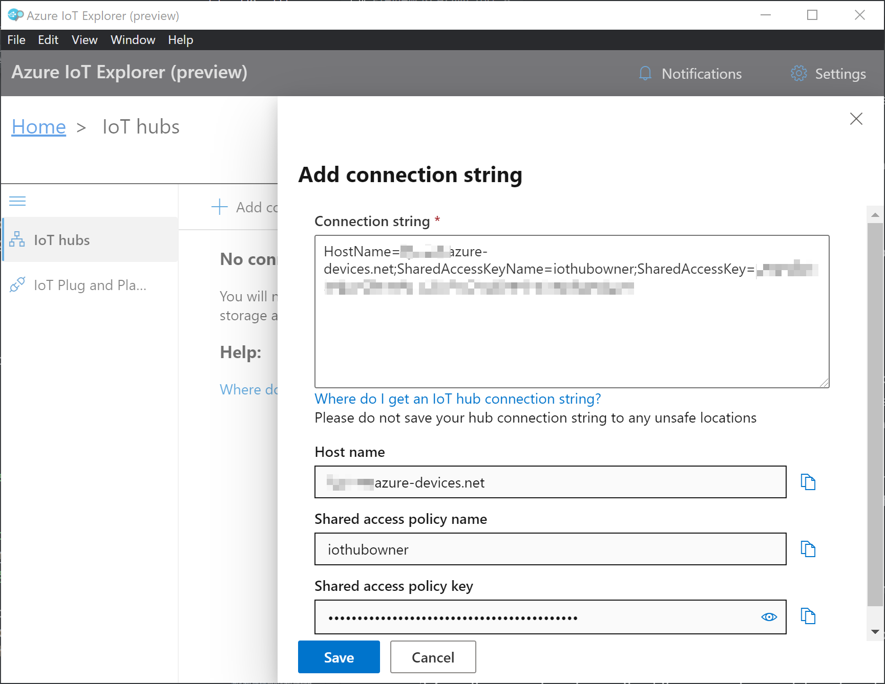
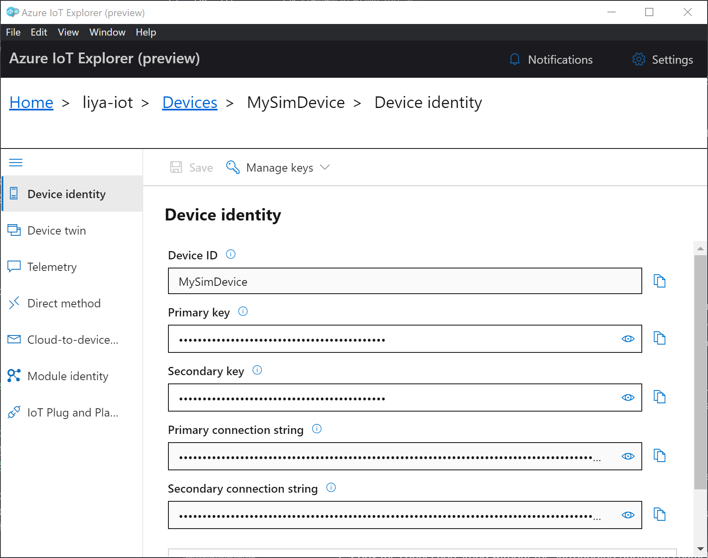
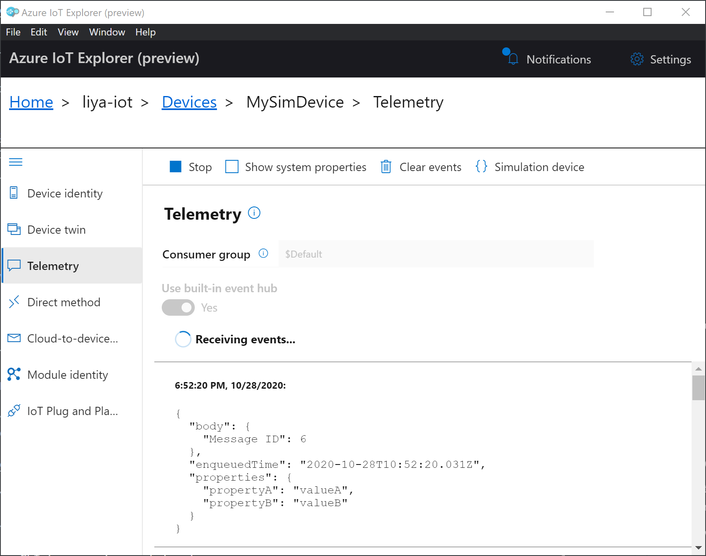
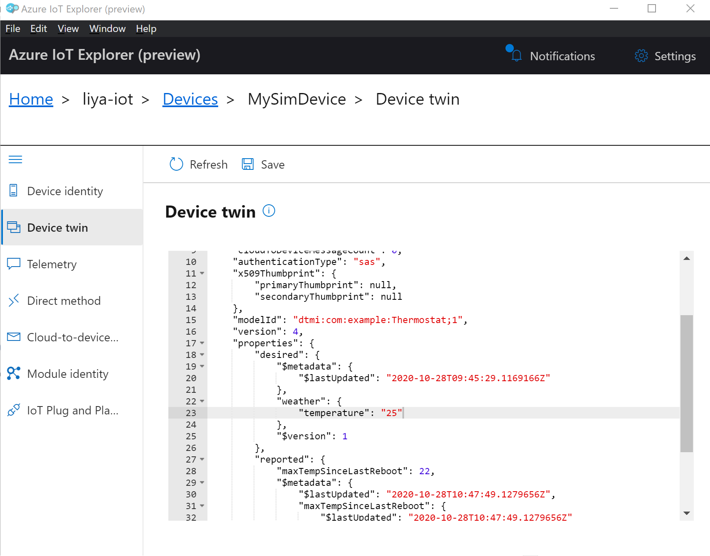
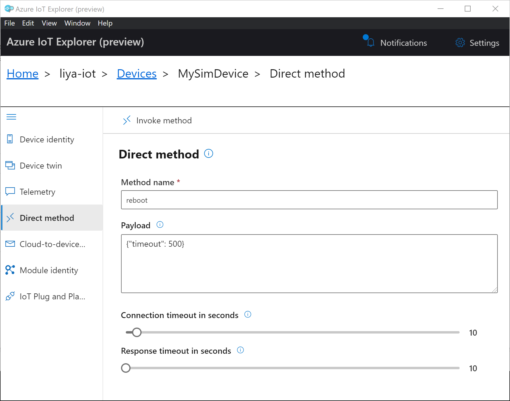
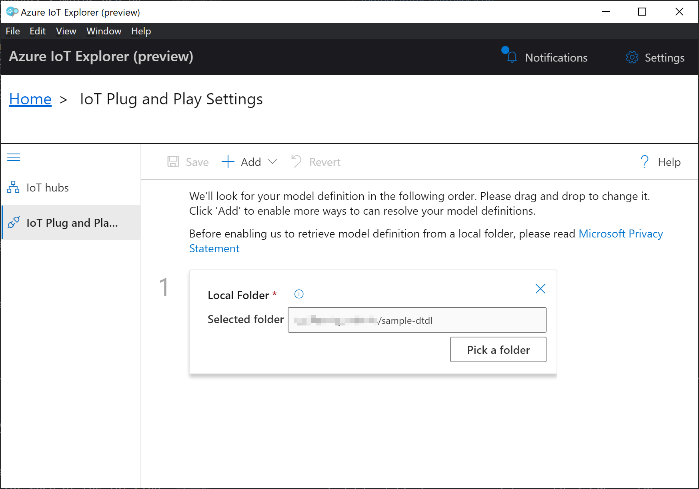
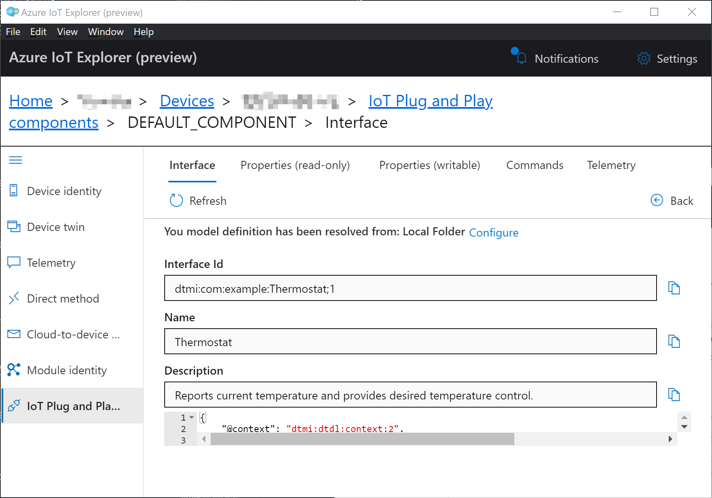

# Azure RTOS samples on x86 using CMake

## Overview

In this tutorial you run Azure RTOS to connect Azure IoT by using [Azure IoT Middleware for Azure RTOS](https://github.com/azure-rtos/netxduo/tree/master/addons/azure_iot) on x86 platform like Windows or Linux. List of samples:

- **sample_azure_iot_embedded_sdk**: Connects an sample IoT Device that is able to send telemetry, update Device Twin and send direct method to the device.
- **sample_azure_iot_embedded_sdk_pnp**: Connects an IoT Plug and Play enabled device (a Thermostat) with the Digital Twin Model ID (DTMI) detailed [here](https://github.com/Azure/opendigitaltwins-dtdl/blob/master/DTDL/v2/samples/Thermostat.json) to IoT Hub, the model is a single component.
- **sample_pnp_temperature_controller**: Connects an IoT Plug and Play enabled device (the Temperature Controller) with the Digital Twin Model ID (DTMI) detailed [here](https://github.com/Azure/opendigitaltwins-dtdl/blob/master/DTDL/v2/samples/TemperatureController.json), the model contains multiple sub-components.

## Prerequisites

- A PC running Microsoft Windows (Windows 10 recommended) or Ubuntu Linux (18.04 or above).
- If you don't have an Azure subscription, [create one for free](https://azure.microsoft.com/free/) before you begin.
- Internet connectivity for your PC.

## Prepare the development environment

- Toolchain
  - On Windows, [Visual Studio](https://code.visualstudio.com) and cmake
  - On Linux, gcc-multilib and cmake
- [Azure IoT Explorer](https://github.com/Azure/azure-iot-explorer/releases): Cross-platform utility to monitor and manage Azure IoT resources

## Prepare Azure resources

To prepare Azure cloud resources and connect a device to Azure, you can use Azure CLI. There are two ways to access the Azure CLI: by using the Azure Cloud Shell, or by installing Azure CLI locally. Azure Cloud Shell lets you run the CLI in a browser so you don't have to install anything.

Use one of the following options to run Azure CLI.

If you prefer to run Azure CLI locally:

1. If you already have Azure CLI installed locally, run `az --version` to check the version. This tutorial requires Azure CLI 2.10.1 or later.
1. To install or upgrade, see [Install Azure CLI](https://docs.microsoft.com/cli/azure/install-azure-cli?view=azure-cli-latest). If you install Azure CLI locally, you can run CLI commands in the GCC Command Prompt, Git Bash for Windows, or PowerShell.

If you prefer to run Azure CLI in the browser-based Azure Cloud Shell:

1. Use your Azure account credentials to sign into the Azure Cloud shell at https://shell.azure.com/.
   > Note: If this is the first time you've used the Cloud Shell, it prompts you to create storage, which is required to use the Cloud Shell. Select a subscription to create a storage account and Microsoft Azure Files share.
1. Select Bash or PowerShell as your preferred CLI environment in the **Select environment** dropdown. If you plan to use Azure Cloud Shell, keep your browser open to run the Azure CLI commands in this tutorial.

   

### Create an IoT hub

You can use Azure CLI to create an IoT hub that handles events and messaging for your device.

To create an IoT hub:

1. In your CLI console, run the [az extension add](https://docs.microsoft.com/cli/azure/extension?view=azure-cli-latest#az-extension-add) command to add the Microsoft Azure IoT Extension for Azure CLI to your CLI shell. The IOT Extension adds IoT Hub, IoT Edge, and IoT Device Provisioning Service (DPS) specific commands to Azure CLI.

   ```shell
   az extension add --name azure-iot
   ```

1. Run the [az group create](https://docs.microsoft.com/cli/azure/group?view=azure-cli-latest#az-group-create) command to create a resource group. The following command creates a resource group named _MyResourceGroup_ in the _centralus_ region.

   > Note: You can optionally set an alternate `location`. To see available locations, run [az account list-locations](https://docs.microsoft.com/cli/azure/account?view=azure-cli-latest#az-account-list-locations). For this tutorial we recommend using `centralus` as in the example CLI command. The IoT Plug and Play feature that you use later in the tutorial, is currently only available in three regions, including `centralus`.

   ```shell
   az group create --name MyResourceGroup --location centralus
   ```

1. Run the [az iot hub create](https://docs.microsoft.com/cli/azure/iot/hub?view=azure-cli-latest#az-iot-hub-create) command to create an IoT hub. It might take a few minutes to create an IoT hub.

   _YourIotHubName_. Replace this placeholder below with the name you chose for your IoT hub. An IoT hub name must be globally unique in Azure. This placeholder is used in the rest of this tutorial to represent your unique IoT hub name.

   ```shell
   az iot hub create --resource-group MyResourceGroup --name {YourIoTHubName}
   ```

1. After the IoT hub is created, view the JSON output in the console, and copy the `hostName` value to a safe place. You use this value in a later step. The `hostName` value looks like the following example:

   `{Your IoT hub name}.azure-devices.net`

### Register a device

In this section, you create a new device instance and register it with the IoT hub you created. You will use the connection information for the newly registered device to securely connect your physical device in a later section.

To register a device:

1. In your console, run the [az iot hub device-identity create](https://docs.microsoft.com/cli/azure/ext/azure-cli-iot-ext/iot/hub/device-identity?view=azure-cli-latest#ext-azure-cli-iot-ext-az-iot-hub-device-identity-create) command. This creates the simulated device identity.

   _YourIotHubName_. Replace this placeholder below with the name you chose for your IoT hub.

   _MySimDevice_. You can use this name directly for the device in CLI commands in this tutorial. Optionally, use a different name.

   ```shell
   az iot hub device-identity create --device-id MySimDevice --hub-name {YourIoTHubName}
   ```

1. After the device is created, view the JSON output in the console, and copy the `deviceId` and `primaryKey` values to use in a later step.

Confirm that you have the copied the following values from the JSON output to use in the next section:

> - `hostName`
> - `deviceId`
> - `primaryKey`

## Prepare the simulated device

To use your PC as a simulated device connect to Azure, you'll modify a configuration file for Azure IoT settings, build and run the application code.

### Add configuration

In VSCode, edit the file `sample_config.h` within the sample folder to set the Azure IoT device information constants to the values that you saved after you created Azure resources.

| Constant name          |              Value              |
| ---------------------- | :-----------------------------: |
| `HOST_NAME`            | {_Your Iot hub hostName value_} |
| `DEVICE_ID`            |     {_Your deviceID value_}     |
| `DEVICE_SYMMETRIC_KEY` |    {_Your primaryKey value_}    |

### Build application on Windows

1. Open a terminal in current folder. Generate build files by command,
```
cmake -Bbuild -A WIN32 .
```
2. Build project in parallel,
```
cmake --build build -j 8
```
### Build application on Linux

1. Open a terminal in current folder. Generate build files by command,
```
cmake -Bbuild .
```
2. Build project in parallel,
```
cmake --build build -j 8
```

## View device properties

You can use the Azure IoT Explorer to view and manage the properties of your devices. In the following steps, you'll add a connection to your IoT hub in IoT Explorer. With the connection, you can view properties for devices associated with the IoT hub. Optionally, you can perform the same task using Azure CLI.

To add a connection to your IoT hub:

1. In your CLI console, run the [az iot hub show-connection-string](https://docs.microsoft.com/en-us/cli/azure/iot/hub?view=azure-cli-latest#az-iot-hub-show-connection-string) command to get the connection string for your IoT hub.

   ```shell
   az iot hub show-connection-string --name {YourIoTHubName}
   ```

1. Copy the connection string without the surrounding quotation characters.
1. In Azure IoT Explorer, select **IoT hubs > Add connection**.
1. Paste the connection string into the **Connection string** box.
1. Select **Save**.

   

If the connection succeeds, the Azure IoT Explorer switches to a **Devices** view and lists your device.

To view device properties using Azure IoT Explorer:

1. Select the link for your device identity. IoT Explorer displays details for the device.

   

1. Inspect the properties for your device in the **Device identity** panel.
1. Optionally, click the **Device twin** panel and inspect additional device properties.

To use Azure CLI to view device properties:

1. Run the [az iot hub device-identity show](https://docs.microsoft.com/en-us/cli/azure/ext/azure-iot/iot/hub/device-identity?view=azure-cli-latest#ext-azure-iot-az-iot-hub-device-identity-show) command.

   ```shell
   az iot hub device-identity show --device-id MySimDevice --hub-name {YourIoTHubName}
   ```

1. Inspect the properties for your device in the console output.

## View device telemetry

With Azure IoT Explorer, you can view the flow of telemetry from your device to the cloud. Optionally, you can perform the same task using Azure CLI.

To view telemetry in Azure IoT Explorer:

1. In IoT Explorer select **Telemetry**. Confirm that **Use built-in event hub** is set to _Yes_.
1. Select **Start**.
1. View the telemetry as the device sends messages to the cloud.

   

   Note: You can also monitor telemetry from the device by using the Termite terminal.

1. Select **Stop** to end receiving events.

To use Azure CLI to view device telemetry:

1. In your CLI console, run the [az iot hub monitor-events](https://docs.microsoft.com/en-us/cli/azure/ext/azure-iot/iot/hub?view=azure-cli-latest#ext-azure-iot-az-iot-hub-monitor-events) command. Use the names that you created previously in Azure IoT for your device and IoT hub.

   ```shell
   az iot hub monitor-events --device-id MySimDevice --hub-name {YourIoTHubName}
   ```

1. View the JSON output in the console.

   ```json
   {
     "event": {
       "origin": "MySimDevice",
       "module": "",
       "interface": "",
       "component": "",
       "payload": "{\"Message ID\": 5}"
     }
   }
   ```

1. Select CTRL+C to end monitoring.

## Update device twin

Now use Azure IoT Explorer to update the device twin on the device. In this section, you set the desired properties from cloud that mimics to update the temperature configuration the device. Optionally, you can perform the same task using Azure CLI.

To update the device twin in Azure IoT Explorer:

1. Select **Device twin**.

1. In the **Device twin** panel, select **Refresh** to retrieve the device twin.

1. Modify the device twin by adding the following JSON into the `"desired"` section it:

   ```json
   "weather": {
       "temperature": "25"
   },
   ```

   

1. Select **Save**.

1. You should see the VSCode output window to monitor the status of desired property.

   ```output
   Receive desired property call: {"weather":{"temperature":"25"},"$version":2}
   ```

To use Azure CLI to update the device twin:

1. Run the [az iot hub device-twin update](https://docs.microsoft.com/en-us/cli/azure/ext/azure-iot/iot/hub/device-twin?view=azure-cli-latest#ext_azure_iot_az_iot_hub_device_twin_update) command and specify the desired property.

   ```shell
   az iot hub device-twin update --device-id MySimDevice --desired "{\"weather\": {\"temperature\": \"25\"}}" --hub-name {YourIoTHubName}
   ```

   The CLI console shows the status of your device twin update on the device, you can find the JSON payload you just sent in there.

1. View the VSCode terminal to confirm the output messages:

   ```output
   Receive desired property call: {"weather":{"temperature":"25"},"$version":2}
   ```

## Call a direct method on the device

You can also use Azure IoT Explorer to call a direct method that you have implemented on your device. Direct methods have a name, and can optionally have a JSON payload, configurable connection, and method timeout. In this section, you call a method that mimics to reboot the device. Optionally, you can perform the same task using Azure CLI.

To call a method in Azure IoT Explorer:

1. Select **Direct method**.
1. In the **Direct method** panel add the following values for the method name and payload.

   - **Method name**: `reboot`
   - **Payload**: `{"timeout": 500}`

   

1. Select **Invoke method**. You should see the VSCode output window to monitor the status of the methods.

   ```output
   Receive method call: reboot, with payload:{"timeout":500}
   ```

To use Azure CLI to call a method:

1. Run the [az iot hub invoke-device-method](https://docs.microsoft.com/en-us/cli/azure/ext/azure-iot/iot/hub?view=azure-cli-latest#ext-azure-iot-az-iot-hub-invoke-device-method) command, and specify the method name and payload.

   ```shell
   az iot hub invoke-device-method --device-id MySimDevice --method-name reboot --method-payload "{\"timeout\": 500}" --hub-name {YourIoTHubName}
   ```

   The CLI console shows the status of your method call on the device, where `200` indicates success.

   ```json
   {
     "payload": {
       "status": "OK"
     },
     "status": 200
   }
   ```

1. View the VSCode terminal to confirm the output messages:

   ```output
   Receive method call: reboot, with payload:{"timeout":500}
   ```

## Use IoT Plug and Play

IoT Plug and Play provides an open device model that lets applications programmatically query a device's capabilities and interact with it. A device uses this model to broadcast its capabilities to an IoT Plug and Play-enabled application. By using this model, you can streamline and enhance the tasks of adding, configuring, and managing devices. For more information see the [IoT Plug and Play documentation](https://docs.microsoft.com/azure/iot-pnp/).

### Prerequisites

To run IoT Plug and Play samples, use **sample_azure_iot_embedded_sdk_pnp** or **sample_pnp_temperature_controller** and follow the same steps in [Prepare the simulated device](#prepare-the-simulated-device) section to build and run the device application.

### Add device model in Azure IoT Explorer

In this section you configure IoT Explorer to add an IoT Plug and Play device model. Adding the model enables IoT Explorer to interact with the IoT Plug and Play components on compatible devices.

To add a device model to IoT Explorer:

1. Confirm that the device you used for the tutorial is connected to the IoT Hub you created.
1. Right click on below two IoT Plug and Play sample components samples use by right click on the link and choose **Save as**. Ensure you save `.json` files to a local folder.
   - [Thermostat.json](https://raw.githubusercontent.com/Azure/opendigitaltwins-dtdl/master/DTDL/v2/samples/Thermostat.json)
   - [TemperatureController.json](https://raw.githubusercontent.com/Azure/opendigitaltwins-dtdl/master/DTDL/v2/samples/TemperatureController.json)
1. Open IoT Explorer.
1. Navigate to **Home**.
1. Select **IoT Plug and Play Settings**.
1. Select **Add > Local folder**.
1. Select **Pick a folder**.
1. Find the folder containing the above JSON files.
1. Click **Select**.
1. Select **Save**.

   

### Access the IoT Plug and Play components

To access the IoT Plug and Play components on your device:

1. Select **IoT hubs > View devices in this hub**.
1. Select your device.
1. Select **IoT Plug and Play components**.
1. Select **Default component**. IoT Explorer displays the IoT Plug and Play components that are implemented on your device.

   

1. On the **Interface** tab, view the JSON content in the device model **Description**. The JSON contains configuration details for each of the IoT Plug and Play components in the device model. Each tab in IoT Explorer corresponds to one of the IoT Plug and Play components in the device model.

### View device properties

To view device properties:

1. Select the **Properties (read-only)** tab to view the read-only properties.
1. Select the **Properties (writable)** tab. It displays the target temperature you can set.
1. Change the `targetTemperature` to _25_, and then select **Update desired value**. Your device now receives this newly set property.

### View device telemetry

To view device telemetry:

1. Select the **Telemetry** tab. Confirm that **Use built-in event hub** is enabled.
1. Select **Start**. IoT Explorer displays telemetry.
1. Select **Show modeled events**. IoT Explorer should display the telemetry as defined in the device model. In this case, the telemetry is temperature.

### Call a direct method on the device

To call a direct method on the connected device:

1. Select the **Commands** tab.
1. For the `getMaxMinReport` command, set **since** to the date format shows in the input box.
1. Select **Send command**. Confirm in the VSCode output window the command has been received.

## Clean up resources

If you no longer need the Azure resources created in this tutorial, you can use the Azure CLI to delete the resource group and all the resources you created for this tutorial. Optionally, you can use Azure IoT Explorer to delete individual resources including devices and IoT hubs.

If you continue to another tutorial in this getting started guide, you can keep the resources you've already created and reuse them.

> **Important**: Deleting a resource group is irreversible. The resource group and all the resources contained in it are permanently deleted. Make sure that you do not accidentally delete the wrong resource group or resources.

To delete a resource group by name:

1. Run the [az group delete](https://docs.microsoft.com/cli/azure/group?view=azure-cli-latest#az-group-delete) command. This removes the resource group, the IoT Hub, and the device registration you created.

   ```shell
   az group delete --name MyResourceGroup
   ```

1. Run the [az group list](https://docs.microsoft.com/cli/azure/group?view=azure-cli-latest#az-group-list) command to confirm the resource group is deleted.

   ```shell
   az group list
   ```
